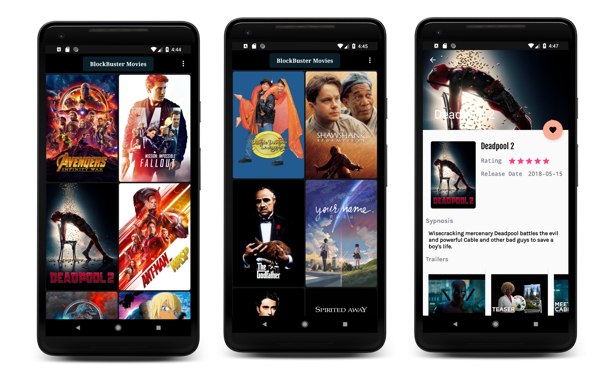

# Popular Movies
This app is built with **MVVM** Design Pattern check out the **MVP and Kotlin** version of this app [here](https://github.com/natansh25/MVP_MovieApp) and simple **Kotlin version** [here](https://github.com/natansh25/Kotlin_MovieApp).
- [LiveData](https://developer.android.com/topic/libraries/architecture/livedata)
- [ViewModel](https://developer.android.com/topic/libraries/architecture/viewmodel)
- [Room](https://developer.android.com/training/data-storage/room/)
- [Repository](https://developer.android.com/jetpack/docs/guide)
- [RxJava2/RxAndroid](https://github.com/ReactiveX/RxAndroid)

## Features

With the app, you can:
* Explore the most popular and top rated movies.
* Mark as favorite any movie for easy access in the future.
* Watch movie trailers.
* Read movie reviews.
* Main movie information as well as cached images stored in a local database so you can browse it even offline.


## How to Work with the Source

This app uses [The Movie Database](https://www.themoviedb.org/documentation/api) API to retrieve movies.
You must provide your own API key in order to build the app. Generate you API_KEY and replace it in ApiClient.java class

## Screenshots



## Used libraries:

* [Picasso](http://square.github.io/picasso/)
* [Retrofit](http://square.github.io/retrofit/)
* [ButterKnif](http://jakewharton.github.io/butterknife/)


## License:
```
Copyright 2018, Natansh Pandya

Licensed under the Apache License, Version 2.0 (the "License");
you may not use this file except in compliance with the License.
You may obtain a copy of the License at

    http://www.apache.org/licenses/LICENSE-2.0

Unless required by applicable law or agreed to in writing, software
distributed under the License is distributed on an "AS IS" BASIS,
WITHOUT WARRANTIES OR CONDITIONS OF ANY KIND, either express or implied.
See the License for the specific language governing permissions and
limitations under the License.
```
